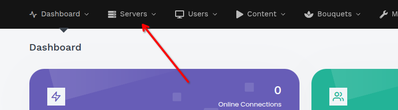
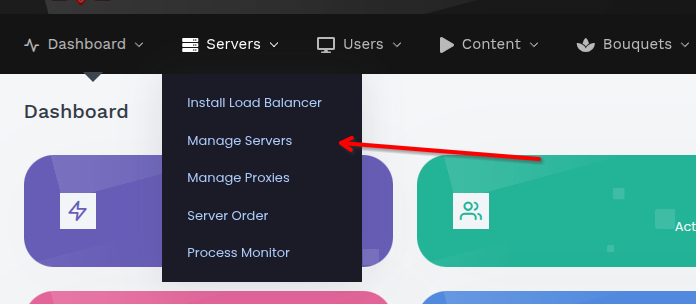
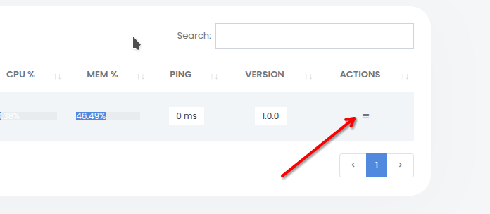
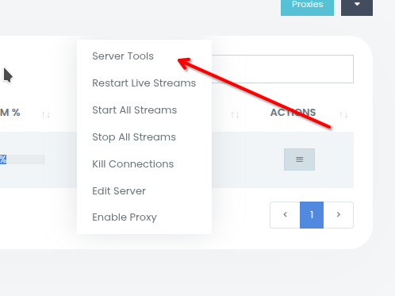
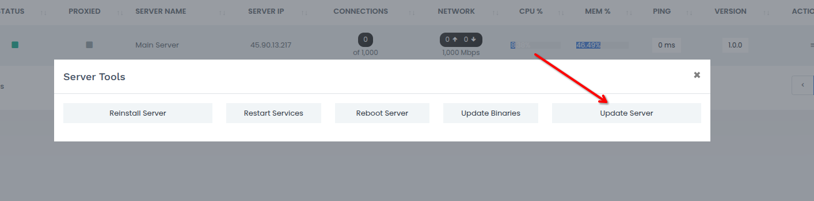

# 🔄 Руководство по обновлению XC_VM

В этом документе описан процесс обновления XC_VM через веб-панель управления. Следуйте шагам, чтобы безопасно обновить систему и избежать ошибок.

---

## ⚙️ Перед началом

Перед обновлением убедитесь, что готовы все необходимые ресурсы. Это поможет избежать проблем и потери данных.

- 🔑 **Доступ администратора** к панели управления.  
- 🌐 **Стабильное интернет-соединение**.  
- 💾 **Резервная копия данных сервера** *(настоятельно рекомендуется создать перед началом)*.

> ⚠️ **Важно:** Не прерывайте процесс обновления, чтобы избежать повреждения системы.

---

## 🪜 Пошаговая инструкция

Следуйте этим шагам для обновления через панель. Каждый этап иллюстрирован скриншотом для удобства.

### 1️⃣ Перейдите в раздел **“Servers”**

- Авторизуйтесь в панели управления.  
- Выберите раздел **Servers** в главном меню.  

  

### 2️⃣ Выберите **“Manage Servers”**

- В разделе **Servers** нажмите **Manage Servers**, чтобы открыть список доступных серверов.  

  

### 3️⃣ Откройте меню **“Actions”**

- Найдите сервер, который требуется обновить.  
- Нажмите кнопку **Actions** — обычно это выпадающее меню или значок рядом с сервером.  

  

### 4️⃣ Перейдите в раздел **“Server Tools”**

- В меню **Actions** выберите пункт **Server Tools**, чтобы открыть инструменты управления сервером.  

  

### 5️⃣ Запустите **“Update Server”**

- В разделе **Server Tools** нажмите **Update Server**.  
- Подтвердите действие, если потребуется (возможно, будет запрошен пароль).  
- Дождитесь завершения обновления — **не прерывайте процесс**, чтобы избежать ошибок.  

  

---

## 💻 Обновление через CLI

Если веб-панель недоступна или вы предпочитаете командную строку, обновление можно запустить напрямую через SSH.

### Подключение и запуск

1. Подключитесь к серверу по SSH.
1. При необходимости сделайте консольный скрипт исполняемым:

```bash
sudo chmod +x /home/xc_vm/console.php
```

1. Выполните команду:

```bash
sudo -u xc_vm /home/xc_vm/console.php update update
```

> ⚠️ **Важно:** Команда должна выполняться от имени пользователя `xc_vm`. Не запускайте от `root` напрямую.

### Что происходит

- Система проверяет наличие новой версии на GitHub.
- Скачивается архив обновления и проверяется его контрольная сумма (MD5).
- Запускается системный скрипт обновления, который останавливает сервисы, применяет файлы и запускает пост-обновление.

---

## 🧠 Примечания и рекомендации

> 🕒 **Время обновления**  
> Зависит от размера сервера и скорости интернет-соединения. Обычно занимает от нескольких минут до часа.
>
> ✅ **Проверка после обновления**  
> После завершения проверьте состояние сервера, перезапустите сервисы и убедитесь, что всё работает корректно.
>
> ⚠️ **Ошибки при обновлении**  
> В случае ошибок проверьте логи сервера (например, в `/home/xc_vm/update.log`). Если проблема persists, создайте issue в [репозитории](https://github.com/Vateron-Media/XC_VM/issues).

---
